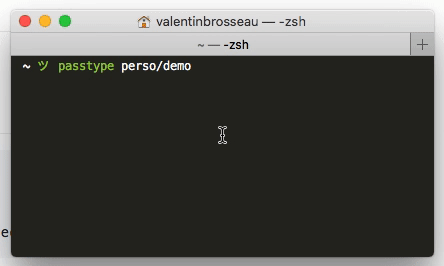

# pass-type

A pass extension for « typing » instead of copy/pasting

## Usage

```
Usage:

    pass type pass-name
    Simulate typing of your password 3seconds after the decode.
```

## Installation

### Arch Linux

You can install this extension by installing the `pass-type-git` package.

### Local plugin

- Enable password-store extensions by setting PASSWORD_STORE_ENABLE_EXTENSIONS=true
- copy type.bash in ~/password-store/.extensions

## Example



```shell
$ PASSWORD_STORE_ENABLE_EXTENSIONS=true pass type perso/demo
The password will be type in 3 seconds
[… 3 seconds later]
$ SUPER SECURE PASSWORD
```

## Custom delay & auto-submit

You can change the delay before the « typing » :

```bash
$ pass type -d 20 perso/demo
The password will be type in 20 seconds
```

You can also send the enter keycode after simulate password typing with the ```-a``` option :

```bash
$ pass type -a perso/demo
The password will be type in 3 seconds
$ SUPER SECURE PASSWORD
$
```

## Requirements

- ```pass``` 1.7.0 or later for extension support
- ```xdotools``` for Linux

## Contribution

Contributions are always welcome.
